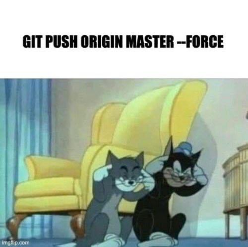

## Hi, I'm minus273dot15

```java
import java.util.ArrayList;
import java.util.HashMap;
import java.util.List;
import java.util.Map;

public class Minus273dot15 {
    private String username, name, position, web, cv;
    private Map<String, List<String>> code;
    private List<String> architecture;

    public Minus273dot15() {
        this.username = "minus273dot15";
        this.name = "Nikolay Zhelev";
        this.position = "Java Software Developer";
        this.web = "http://badmin.org";
        this.cv = "https://app.enhancv.com/share/48fdfcbd";
        this.code = new HashMap<>();
        this.code.put("backend", List.of("Java", "PHP"));
        this.code.put("database", List.of("NoSQL", "MySQL", "MsSQL"));
        this.code.put("devops", List.of("Linux", "MS Server", "Proxmox", "Citrix", "Hyper-V"));
        this.code.put("frontend", List.of("HTML", "CSS", "Boostrap"));
        this.code.put("tools", List.of("GIT", "GitHub", "GitLab"));
        this.code.put("misc", List.of("Perl", "PowerShell", "IIS", "Networking"));
        this.architecture = List.of("MVC");
    }

    @Override
    public String toString() {
        return name + " | " + position;
    }

    public static void main(String[] args) {
        Minus273dot15 me = new Minus273dot15();
        System.out.println(me);
    }
}


